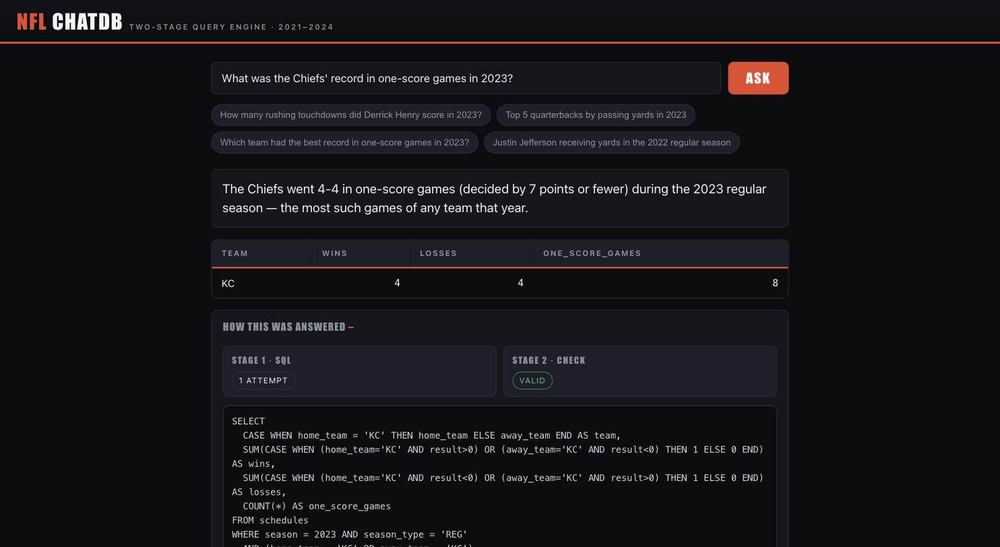

# NFL Chat-With-Your-Database

Ask NFL questions in plain English, get a SQL-backed answer. The point of
the project isn't the SQL generation — models are good at that now — it's
the **verification**: separating *"is this SQL valid"* from *"does this SQL
actually mean what was asked"*, without a hand-written semantic layer.



## The pipeline

| Stage | Model | Job |
|---|---|---|
| **1 — generate** | Haiku 4.5 (Sonnet 5 on retry) | Write one `SELECT`, self-correct on execution errors |
| **2 — verify** | Sonnet 5 | Does the query measure the right thing, at the right grain, in the right scope? If not: concrete issues + whether a rewrite would help |
| **retry** | — | If Stage 2 rejects *and* a rewrite could help, Stage 1 gets one more shot with every issue + the rejected SQL |
| **fallback** | Sonnet 5 | If a ranking query over-filtered itself to zero rows, list the raw matching records instead of "no results" |
| **3 — answer** | Haiku 4.5 | Phrase the settled result in a sentence, and flag it when the data doesn't really answer the question (tiny sample, degenerate ranking, implausible numbers) |

Why NFL: the vocabulary — *quarter, completion, red zone, EPA, air yards* —
is already in an LLM's general knowledge, so it substitutes for the
semantic layer a business schema would need. That's a deliberate, fixed
constraint (see `docs/superpowers/specs/2026-09-01-nfl-chat-db-design.md`),
not a placeholder for a future glossary.

## Data

Six nflverse datasets, ingested into a local SQLite file, spanning four
grains so Stage 1 can pick the coarsest table that answers the question:

| Table | Rows | Grain |
|---|---:|---|
| `schedules` | 1,139 | one row per game — scores, `result` (home margin), spreads, weather, starting QBs |
| `seasonal_stats` | 2,469 | one row per player per season |
| `weekly` | 22,579 | one row per player per game |
| `rosters` | 12,397 | one row per player per season — position, height/weight, college, age, draft |
| `snap_counts` | 106,004 | snap participation per player per game |
| `play_by_play` | 198,513 | one row per play — the detailed, slow path |

`game_id` and GSIS `player_id` join cleanly across all of these **except
`snap_counts`**, which uses PFR's own id scheme — cross-table questions
involving snaps aren't supported without an id-mapping step.

## Setup

```bash
uv sync
cp .env.example .env          # then put your ANTHROPIC_API_KEY in it
uv run python -m nfl_chatdb.ingest   # one-time, ~2 min, pulls from nflverse
```

## Use

```bash
uv run nfl-chatdb-app         # desktop app (pywebview)
uv run nfl-chatdb "How many rushing touchdowns did Derrick Henry score in 2023?"
```

### Questions worth trying

| Question | Shows |
|---|---|
| How many receiving yards did Justin Jefferson have in the 2022 regular season? | clean lookup (1,809) |
| Top 5 quarterbacks by passing yards in 2023 | leaderboard off `weekly` |
| Which team had the best record in one-score games in 2023? | Stage 1 picks `schedules` — query in milliseconds |
| What is a team's record when leading at halftime? | conditional analysis — `play_by_play` |
| Which QB has the best record in games with 15 or fewer total points? | only 8 such games — Stage 3 says there's no meaningful ranking and lists them |
| Who is the most clutch quarterback? | too vague — flagged, no invented definition |

### An example of the verification working

> **Q:** Given a team gets 100+ combined first-half yards, what are the odds of winning?

Stage 1 wrote a query that added an arbitrary `HAVING games >= 2` and
returned `100.0%` off a single game. Stage 2 flagged it (`"the LIMIT 1
makes the win percentage meaningless"`); the retry didn't fully fix it;
Stage 3 returned *"this rests on a degenerate one-row result, not a real
statistic"* and the app showed the caveat instead of a confident "100%".

## Test

```bash
uv run pytest            # unit tests, no network
uv run pytest -m live    # live API + a real single-season ingest (costs money)
```
